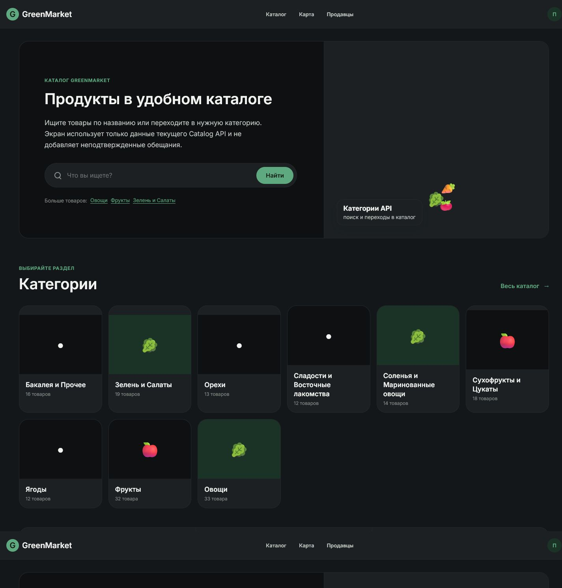
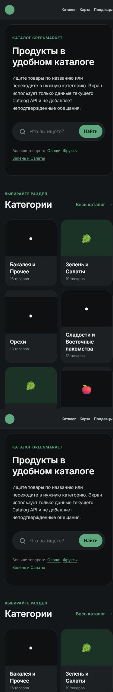

# GreenMarket — Stage 1 Screen Delivery

Доработана стартовая React-страница Buyer MVP (`/`) в рамках Stage 1 и AI-first Engineering Process MVP v1.0.

Это не map-based «Главный экран» Customer UI из ТЗ-001/ТЗ-023. В тех документах главным рабочим пространством являются карта и Bottom Sheet; здесь изменена существующая точка входа Buyer MVP с каталогом и поиском.

## Результат

- новый hero-блок с продуктовым позиционированием;
- поиск товаров с переходом в каталог;
- адаптивная сетка категорий;
- быстрые популярные запросы;
- обновлённая desktop/mobile навигация;
- исправленный контраст светлой и тёмной темы;
- сохранённые loading/error-состояния;
- отсутствие изменений Domain Model, Repository Contract и Runtime Platform Core: задача ограничена существующим React UI, Catalog API и React Router.

## Скриншоты

### Desktop



### Mobile



## Процесс разработки

Полный Context Report, Task Decomposition Report, backlog, критерии приёмки, Self Review, Knowledge Delta и Human Review Checklist находятся в [STAGE1_HOME_SCREEN_REPORT.md](docs/process/STAGE1_HOME_SCREEN_REPORT.md).

## Запуск

```bash
cd react-vite-bootstrap-project
npm install
npm run dev
```

Приложение будет доступно по адресу `http://localhost:5173/`.

## Проверки

- `npm run build` — успешно;
- `npm run lint` — успешно;
- production smoke-test — HTTP 200;
- Catalog API — доступен;
- каталог — 9 товаров;
- поиск «молоко» — 1 результат;
- desktop/mobile screenshots — приложены.

## Статус

Реализация завершена и готова к Human Review заказчиком.
